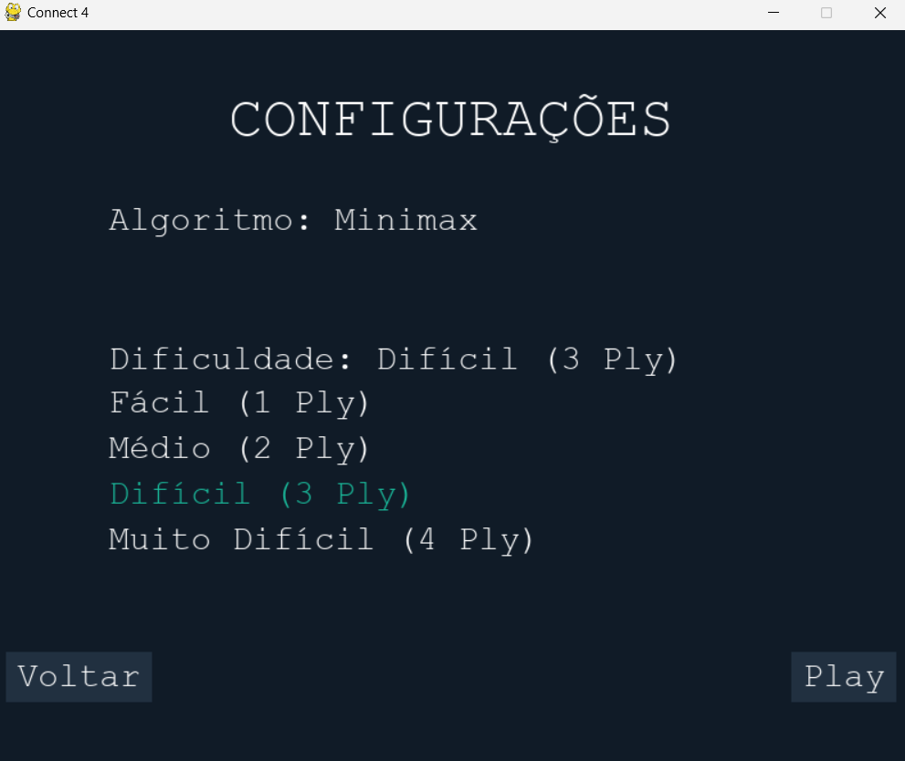

# Connect 4 Game

Este é um jogo clássico de **Connect 4**, implementado em Python usando a biblioteca `Pygame`. O jogo possui IA baseada no algoritmo **Minimax com Poda Alfa-Beta** e interface gráfica intuitiva.

## 🎮 Funcionalidades do Jogo

- **Modo Humano vs IA**: Desafie uma IA que ajusta a dificuldade conforme sua escolha.
- **IA com Minimax**: Avaliação estratégica para buscar a melhor jogada possível.
- **Interface Gráfica**: Layout visual e responsivo com animações suaves.
- **Menu Personalizado**: Configuração de dificuldade, algoritmo e outras opções.
- **Comparação de Algoritmos**: Teste e compare o desempenho entre Minimax e Alfa-Beta.

---

## 🚀 Como Rodar o Jogo

1. **Instale as dependências:**
   ```bash
   pip install pygame numpy
   ```
2. **Execute o script principal:**
   ```bash
   python nome_do_arquivo.py
   ```
3. **Divirta-se!** Escolha suas configurações no menu inicial e comece a jogar.

---

## 📖 Regras do Jogo

- Cada jogador insere uma peça por vez em uma das colunas.
- O objetivo é alinhar 4 peças consecutivas horizontalmente, verticalmente ou diagonalmente.
- O primeiro a alinhar 4 peças vence o jogo!

---

## 🖼️ Telas do Jogo

### 1. **Tela do Menu Principal**
O menu inicial permite escolher entre jogar, configurar o jogo, comparar algoritmos ou sair.


### 2. **Tela de Configurações**
Configuração de dificuldade e escolha do algoritmo (Minimax ou Alfa-Beta).


### 3. **Tela do Jogo**
Tabuleiro dinâmico com animações para as jogadas e pontuações exibidas.


### 4. **Tela de Fim de Jogo**
Mensagem de vitória ou derrota com opções para reiniciar ou voltar ao menu principal.


### 5. **Tela About**
Informações sobre o jogo e desenvolvedor.


---

## ⚙️ Estrutura do Código

- **Minimax com Poda Alfa-Beta**:
  O núcleo da IA que calcula as melhores jogadas com eficiência.

- **Avaliação Heurística**:
  Análise estratégica de cada estado do tabuleiro.

- **Renderização Gráfica**:
  Construção do tabuleiro, peças e animações.

---

## 🛠️ Tecnologias Utilizadas

- **Python 3.x**
- **Pygame**
- **NumPy**

---

## 👨‍💻 Autor

Desenvolvido por **Micael Resende**.  
Se tiver dúvidas ou sugestões, entre em contato!

---

## 📜 Licença

Este projeto é de código aberto e está sob a licença [MIT](LICENSE).

---

## ✨ Agradecimentos

Obrigado por jogar e explorar este projeto!
